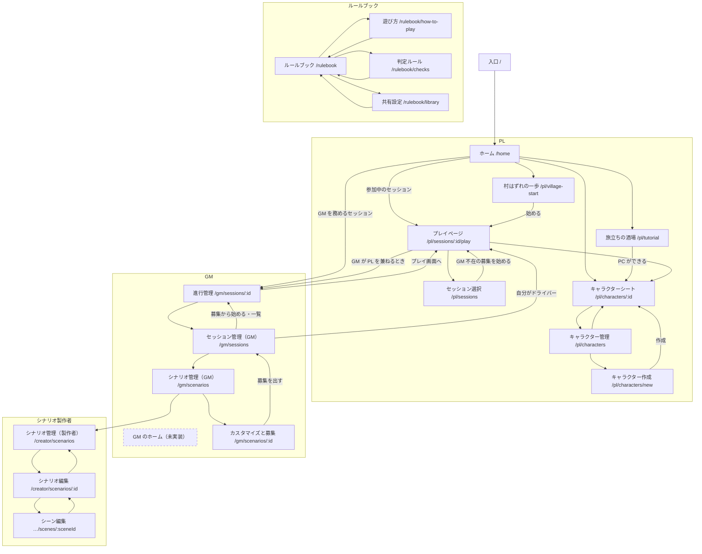

# 画面一覧と導線

アプリ（`apps/web`）の画面の一覧と、画面どうしのつながり（導線）を置く。画面ごとの課題は [画面ごとの課題](issues.md) に置く。

- **正の置き場所** — ルート（パス・画面名・一行の説明）の正は `apps/web/src/shared/routes/routes.ts`（アプリ内のサイトマップ `/admin/sitemap` もここから作る）。このページは、ロールごとのまとまりと導線を読むためのもの。画面を足す・消す・リンクを変えたら、このページの表と図も直す
- **図の描き方** — 矢印は、画面の中のリンク・ボタンで移るもの。点線の枠は、まだ無い画面（課題として挙がっているもの）
- **共通ナビ** — 全画面の上部（とフッタ）にある共通ナビからは、どの画面からでも次へ移れる：ホーム・セッション選択・キャラクター管理・シナリオ管理（GM）・セッション管理（GM）・シナリオ管理（製作者）・ルールブック・サイトマップ。図には描かない（矢印が全画面から出て読めなくなるため）。どれを出すかは `routes.ts` の `nav` が正

## 導線図

システム管理者の画面（サイトマップ `/admin/sitemap`・コンポーネントカタログ `/admin/components`）は、遊ぶ人の導線に入らないので図から省いた。サイトマップは共通ナビとページが見つからないときの画面から開ける。

## 画面の一覧（ロール別）

| ロール | 画面 | パス | できること |
|---|---|---|---|
| 共通 | 入口 | `/` | 扉のカード1枚だけの最初の画面。開くとホームへ進む |
| PL | ホーム | `/home` | 参加中のセッション（中断中も出して「GM の裁定待ち／再開できます」を示し、自分がドライバーならプレイ画面へ）、自分の PC、初めての人の入口（旅立ちの酒場・村はずれの一歩） |
| PL | セッション選択 | `/pl/sessions` | 募集一覧・応募。GM 不在の募集に絞り込み、自分の PC ですぐに始める |
| PL | プレイページ | `/pl/sessions/:sessionId/play` | 手札のプレイ・提案。GM 不在の募集のセッションでは、提案すると中断し、GM の裁定後に「続きを遊ぶ」で再開 |
| PL | キャラクター管理 | `/pl/characters` | 所有 PC と借りられる PC の一覧 |
| PL | キャラクター作成 | `/pl/characters/new` | CP 予算の中でカードプールから選んで PC を作る |
| PL | キャラクターシート | `/pl/characters/:characterId` | 能力値・HP・所持デッキ・称号タグ・結末タグを見る（編集はできない） |
| PL | 旅立ちの酒場 | `/pl/tutorial` | 初めての人向け。酒場の NPC との問答で最初のキャラクターができる |
| PL | 村はずれの一歩 | `/pl/village-start` | 初めての人向け。GM 不在の1人プレイで、村の依頼とお店を経て冒険者試験に挑む |
| GM | GM のホーム | （未実装） | GM としての入口。[課題 GMH-1](issues.md#gm-のホーム) |
| GM | シナリオ管理（GM） | `/gm/scenarios` | シナリオ集からシナリオを選ぶ |
| GM | シナリオのカスタマイズと募集 | `/gm/scenarios/:scenarioId` | カードの取捨選択→募集。通常の募集か GM 不在の募集かを選び、先へ進めないシーン・自動戦闘のシーンの注意を見る |
| GM | セッション管理（GM） | `/gm/sessions` | 自分の募集から始める（GM 不在の募集は始まったセッションの件数）・自分が GM を務めるセッションの一覧 |
| GM | セッションの進行管理 | `/gm/sessions/:sessionId` | 描写と選択肢を配る（取り下げ・移り先の指定）・参加者・ゾーン・進行・提案の裁定（移り先付きで採用できる）・モード切り替え・終了。GM 不在のセッションでは、描写と選択肢の枠を出さず、提案の裁定と終了だけを行う（中断中も裁定・終了できる）。GM が自分のキャラクターでドライバーも務めるときは、プレイ画面とリンクで行き来する |
| シナリオ製作者 | シナリオ管理（製作者） | `/creator/scenarios` | 自分が作ったシナリオの一覧と新規作成 |
| シナリオ製作者 | シナリオ編集 | `/creator/scenarios/:scenarioId` | メタデータ／デッキ構造／結末の編集。結末の追加・削除で結末のノードも対で増減し、選択肢の移り先になっているシーン・結末は消せない。シナリオ集へ公開と非公開。開発サーバーでは公開中のシナリオを `scenarios/<id>.json` に書き、保存したかを画面で知らせる |
| シナリオ製作者 | シーン編集 | `/creator/scenarios/:scenarioId/scenes/:sceneId` | 導入・シーン・結末のノードの編集（カードの配置、選択肢カードの移り先、結末のノードが指す結末、目的・終了条件（仮）） |
| ルールブック | ルールブック | `/rulebook` | 遊び方・判定ルール・共有設定の目次 |
| ルールブック | 遊び方 | `/rulebook/how-to-play` | カード・デッキ・場・手札の考え方と、セッションの進み方 |
| ルールブック | 判定ルール | `/rulebook/checks` | 探索判定（体・技・心＋2d6）と戦闘（カウント制・射程） |
| ルールブック | 共有設定 | `/rulebook/library` | セッションから積みあがった共有設定（正史グラフから格上げされた設定・カード） |
| システム管理者 | サイトマップ | `/admin/sitemap` | 全ページの一覧と役割 |
| システム管理者 | コンポーネントカタログ | `/admin/components` | 共通 UI 部品の一覧とバリエーション |

まだ React にしていない画面（チャット・シーン進行・戦闘画面・場の状況）の試作は、[Webアプリの仕組み「未React化の画面」](../architecture/web-app.md#未react化の画面)。
